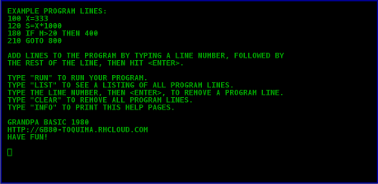

##Grandpa Basic 1980

Programming 1980 style!! The way we did it in the old days. This project
emulates an old fashioned line-numbered BASIC language machine. On a monochrome
monitor, of course, and only upper case letters. Green, or amber if you want to
get fancy with third party equipment.

Emulates the action of a computing platform in common use around the year
1980 - a dedicated machine hard-wired for writing and executing programs
written in a line numbered version of BASIC, based on the original Dartmouth
BASIC. All code was prefixed with line numbers, and execution proceeded
sequentially according to line number except where control structures such as
GOTO or IF/THEN diverted execution elsewhere. These machines, at first, had
monochrome CRT (cathode ray tube) monitors that only printed uppercase letters.
Many of the small machines produced for household or small office use prior to
the introduction of PCs were of this type.

The project was originally written in Coffeescript, using an HTML5 canvas
element to emulate the monochrome, all-caps monitor on the original equipment.
I'm currently working on a branch to convert the project to Typescript. After
that, I'd like to modularize the app so it can also run in a command line
terminal under Node.

Event handling classes echo key press events by printing the characters onto the
'console' (the canvas element) and filling a line buffer. When the <enter> key
is pressed, the ActionController tries to parse the string and build a line object.

Each line object has a "command" property which identifies the type of
command or program line statement it is, as well as other properties which
vary for each type. The test specs are a good resource for describing the
exact format for each type of program line object. Console commands such as
RUN or LIST are executed immediately. Line numbered program statements are
entered into the collection of program line objects, either as a new line if
that line number isn't yet in use, or changing the object for an existing
line number.

When a RUN command is executed, the ProgramController and StatementRunner
classes try to interpret each program line object, accessing them sequentially
according to line number except where program execution is rerouted to
another line number. Values for numeric and string variables are stored in
VariableRegister objects, and output is written to the console emulator.
